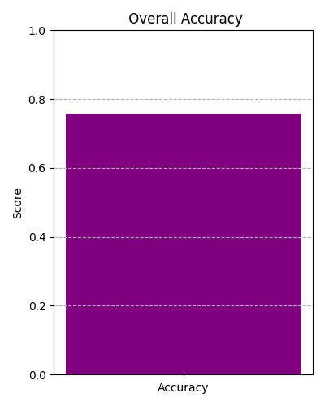
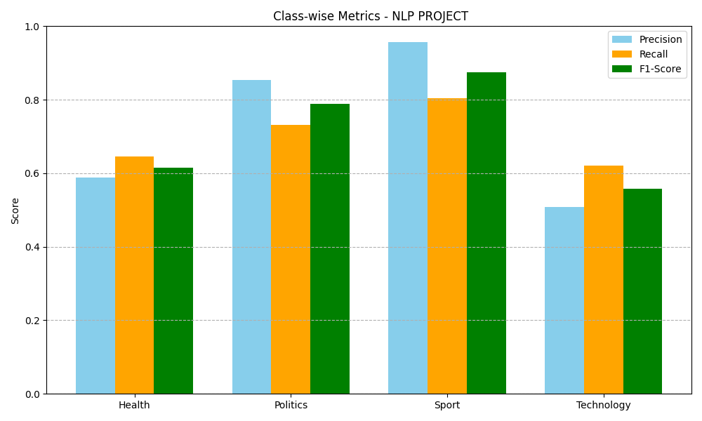
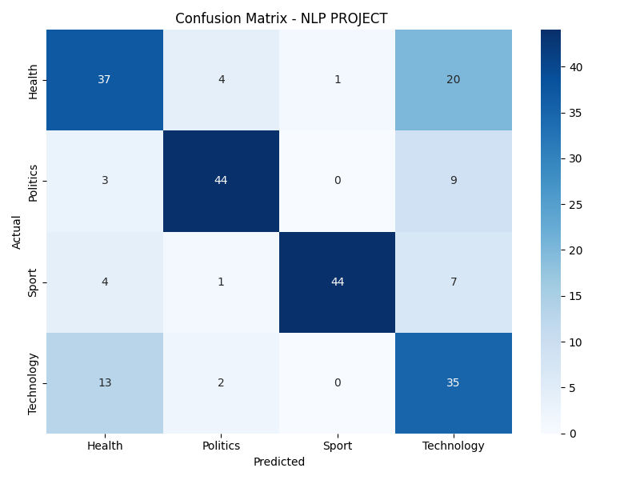

# Amharic News Classifier - BBC Dataset
```
This project is a machine learning-based text classifier that categorizes Amharic news articles into four distinct categories: 
1, Health,
2, Politics,
3, Sport, and
4, Technology.

The classifier is trained using an enhanced dataset sourced from BBC Amharic news, with 250 labeled articles per categor - if we need more accurate one we can add more data by scrapping - means by adding page
number to be scraped.

project is requested by HILCOE school NLP subject.
```
##  Features
```
- Classifies Amharic news articles into 4 categories.
- Enhanced with an expanded dataset for better generalization.
- Evaluation using accuracy, precision, recall, F1-score, and confusion matrix.
- Visual performance metrics included.
```
##  Project Structure
```
NLP/
   data/
            bbc_amharic_dataset_300+.csv     
   models/
            amharic_news_classifier_300+.pkl 
            tfidf_vectorizer_300+.pkl        
   figures/
            accuracy_bar.png                
            classwise_metrics.png            
            confusion_matrix.png            
    scripts/
            classifier.py                    
            import_requests_for_more_than_300_articles.py 
            UI_testing_with_model.py         
    docs/
            NLP_Projects_Guide.pdf          

    requirements.txt                     
    LICENSE                              
    README.md                     


```
---

##  Performance Results

##  Overall Accuracy



##  Class-wise Metrics



##  Confusion Matrix



##  Installation
```
1. Clone the repository:

git clone https://github.com/NuryeNigusMekonen/amharic-news-classifier-in-bbc.git
cd amharic-news-classifier-in-bbc

3. Install dependencies:

pip install -r requirements.txt
```
##  How to Run
```
1. Train the Classifier:
python classifier.py

2. Test on Sample Data:
python UI_testing_with_model.py
```

##  Author
```
👤 Author
Nurye Nigus
Electrical & Software Engineer
📧 Email :    nurye.nigus.me@gmail.com
🌐 LinkedIn   (https://www.linkedin.com/in/nryngs/)
🐙 GitHub:    @NuryeNigusMekonen
📞 Phone :    +251929404324

```
##  License

This project is licensed under the MIT License.

[](LICENSE)
