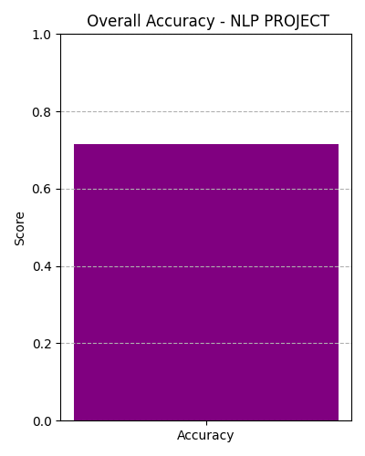
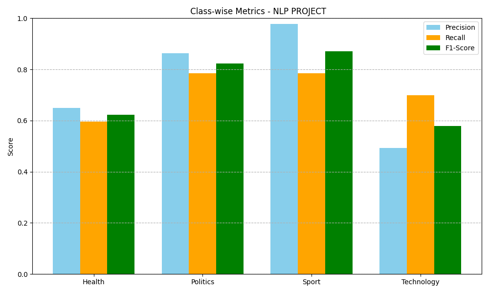

# Amharic News Classifier - BBC Dataset
```
This project is a machine learning-based text classifier that categorizes Amharic news articles into four distinct categories: 
1, Health,
2, Politics,
3, Sport, and
4, Technology.

The classifier is trained using an enhanced dataset sourced from BBC Amharic news, with 250 labeled articles per categor - if we need more accurate one we can add more data by scrapping - means by adding page
number to be scraped.

project is requested by HILCOE school NLP subject.
```
##  Features
```
- Classifies Amharic news articles into 4 categories.
- Enhanced with an expanded dataset for better generalization.
- Evaluation using accuracy, precision, recall, F1-score, and confusion matrix.
- Visual performance metrics included.
```
##  Project Structure
```
NLP/
├── data/
│   └── bbc_amharic_dataset_300+.csv     ← Cleaned dataset
├── models/
│   ├── amharic_news_classifier_300+.pkl ← Trained Logistic Regression model
│   └── tfidf_vectorizer_300+.pkl        ← TF-IDF vectorizer used for text features
├── figures/
│   ├── accuracy_bar.png                 ← Bar chart of overall accuracy
│   ├── classwise_metrics.png            ← Precision, Recall, F1 per class
│   └── confusion_matrix.png             ← Heatmap of classification errors
├── scripts/
│   ├── classifier.py                    ← Trains model and generates visual metrics
│   ├── import_requests_for_more_than_300_articles.py ← Scrapes BBC Amharic site
│   └── UI_testing_with_model.py         ← Predicts category using saved model
├── docs/
│   └── NLP_Projects_Guide.pdf           ← Project guide or instructions
├── requirements.txt                     ← Python dependencies
├── LICENSE                              ← License info
└── README.md                            ← You’re here!
```
---

##  Performance Results

##  Overall Accuracy



##  Class-wise Metrics



##  Confusion Matrix


##  Installation
```
1. Clone the repository:

git clone https://github.com/NuryeNigusMekonen/amharic-news-classifier-in-bbc.git
cd amharic-news-classifier-in-bbc

3. Install dependencies:

pip install -r requirements.txt
```
##  How to Run
```
### Train the Classifier:
python classifier.py

### Test on Sample Data:
python UI_testing_with_model.py
```

##  Author
```
Nurye Nigus Mekonen

Feel free to comment on my repo or contribute by opening issues or pull requests!

```
##  License

This project is licensed under the MIT License.

[](LICENSE)
